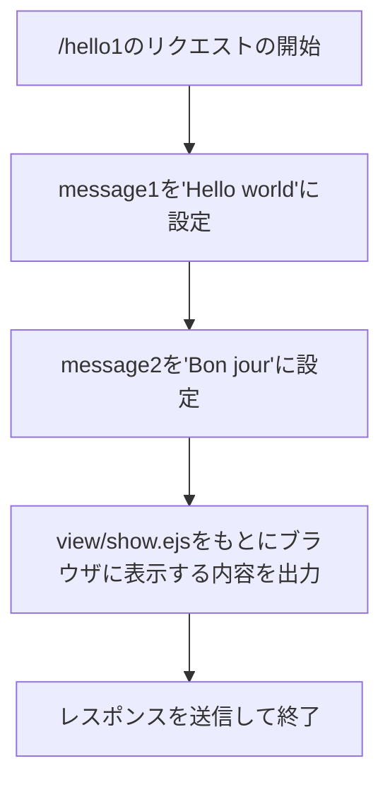
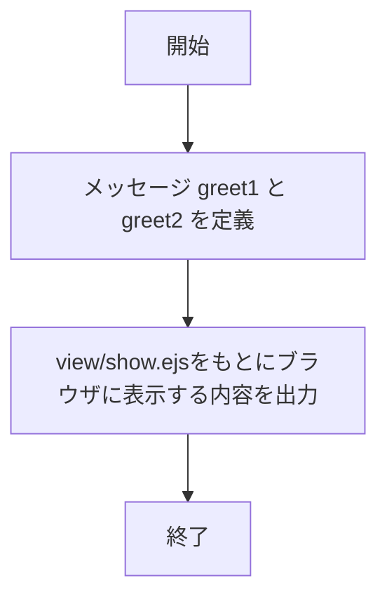
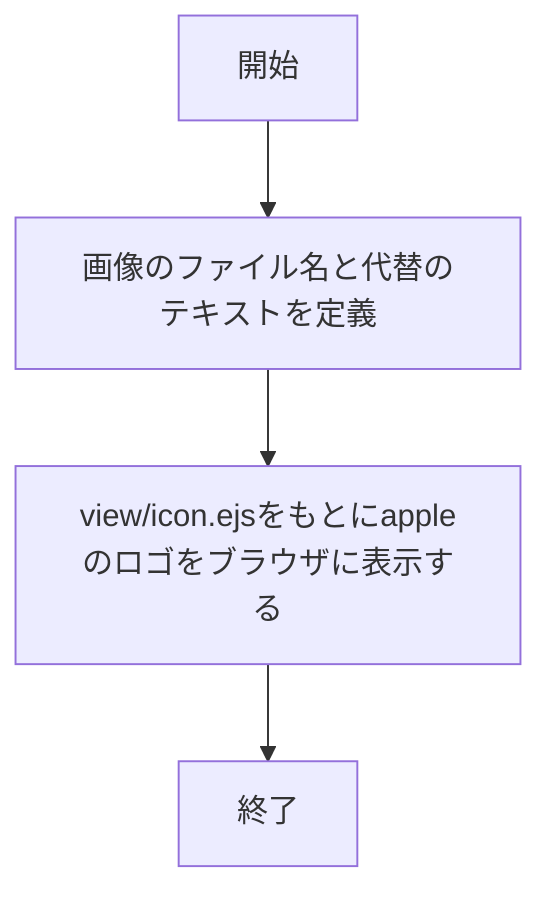
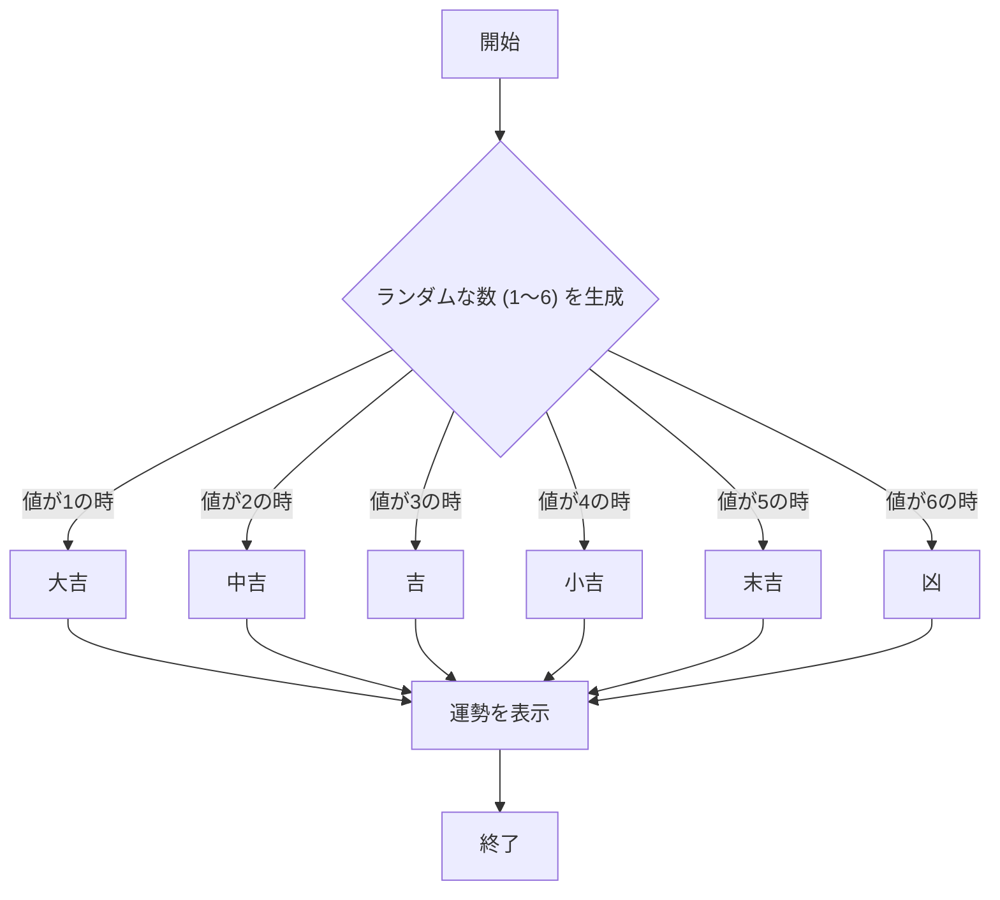
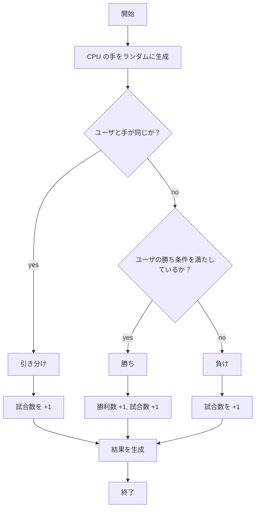
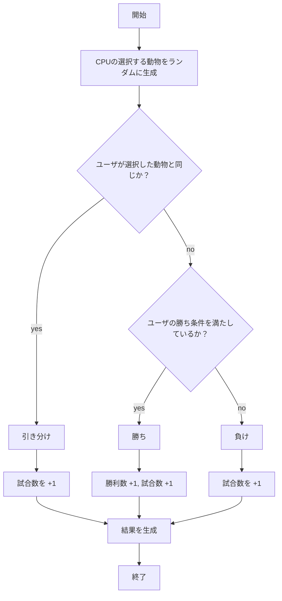
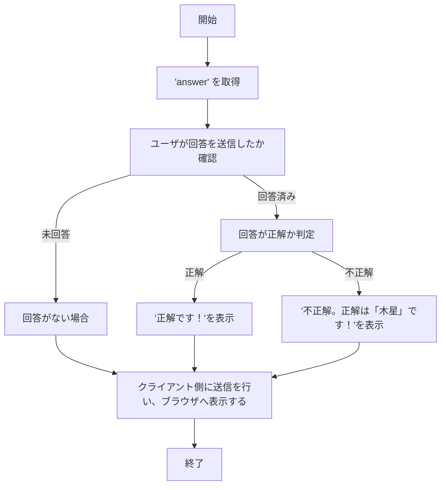

# webpro_06

## このプログラムについて
### ファイル一覧

ファイル名 | 説明
-|-
app5.js|プログラム本体
views/show.ejs | 
views/icon.ejs |
view/luck.ejs |
views/janken.ejs| じゃんけんの開始画面
view/animal.ejs |


## 各ファイルのドキュメントと実行手順
###  1. /hello1
・関数名：```app.get("/hello1", ...)```
・機能：```"Hello world"```と```"Bon jour"```という2つの挨拶のメッセージをブラウザに表示する。
・入力：GETリクエストで/hello1にアクセスされる。
・出力：view/show.ejsのテンプレートを用いて
```挨拶1: "Hello world"```と```挨拶2: "Bon jour"```を表示する。
・引数：```req ```(リクエストオブジェクト)：リクエストに関する情報を持つ。```res``` (レスポンスオブジェクト)：レスポンスを送信するために使用する。
・返り値：なし。

#### 実行手順
1. ```node app5.js```でプログラムを起動する
1. Webブラウザでhttp://localhost:8080/hello1にアクセスする。





###  2. /hello2
関数名：```app.get("/hello2", ...)```
機能：/hello2のGETリクエストを受け取ると,view/show.ejsテンプレートの```greet1```と```greet2```に2つの静的な挨拶のメッセージを表示する。
入力：HTTPのリクエスト（GETリクエスト）
出力：view/show.ejsのテンプレートを用いて```挨拶1: "Hello world"```と```挨拶2: "Bon jour"```を表示する。
引数：```req ```(リクエストオブジェクト),```res``` (レスポンスオブジェクト)
返り値：なし。

#### 実行手順
1. ```node app5.js```でプログラムを起動する
1. Webブラウザでhttp://localhost:8080/hello2にアクセスする





###  3. /icon
関数名：```app.get("/icon", ...) ```
機能：GETリクエストを受け取ると、view/icon.ejsテンプレートをもとにappleロゴの画像を含むHTMLを表示する。
入力：HTTPのリクエスト（GETリクエスト）
出力：view/icon.ejsテンプレートをもとに、filename と altの情報を使って```Apple_logo_black.svg```を表示する。
引数：```req ```(リクエストオブジェクト),```res``` (レスポンスオブジェクト)
返り値：なし。

#### 実行手順
1. ```node app5.js```でプログラムを起動する
1. Webブラウザでhttp://localhost:8080/iconにアクセスする





### 4. /luck
関数名：```app.get("/luck", ...)```
機能：ランダムに 1～6 の整数を生成し、その値に応じた運勢（全六種類：大吉、中吉、吉、小吉、末吉、凶）を決定し、運勢結果をブラウザに表示する。
入力：HTTPリクエスト（GET リクエスト）で/luck にアクセスすることで動作する。
出力：view/luck.ejsテンプレートファイルのもとにブラウザに運勢を表示する。```あなたの今日の運勢は + luck + です．```のluckに運勢のテキストを出力している。
引数：```req ```(リクエストオブジェクト),```res``` (レスポンスオブジェクト)
返り値：なし。

#### 実行手順
1. ```node app5.js```でプログラムを起動する
1. Webブラウザでhttp://localhost:8080/luckにアクセスする





### 5. /janken
関数名：```app.get("/janken",...)```
機能：ユーザの手とランダムに選ばれるコンピュータの手を比較し、勝敗または引き分けの判定を行う。また勝利数および総試合数を更新する。
入力：HTTPリクエスト（GET リクエスト）、パラメータとして下記のものを受け取る。
入力 | 説明
-|-
hand|ユーザの選んだ手であり、「グー」「チョキ」「パー」のいずれかを格納する。
win | ユーザの勝利数
total | 試行回数

出力：view/jankenのテンプレートファイルから以下の情報を出力する。
出力 | 説明
-|-
your|ユーザの選んだ手（「グー」「チョキ」「パー」のいずれか）
cpu | コンピュータの手
judgement | 勝敗の判定結果
win | ユーザの勝利数
total | 試行回数

引数：```req ```(リクエストオブジェクト)でパラメータとしてhand, win, total を受け取る。
```res``` (レスポンスオブジェクト)
返り値：なし。

#### 実行手順
1. ```node app5.js```でプログラムを起動する
1. Webブラウザでhttp://localhost:8080/jankenにアクセスする
1. ユーザとして「グー」「チョキ」「パー」のいずれか入力し、送信する。



### 4. /animal
関数名：```app.get("/animal",...)```
機能：ユーザが三つの選択肢の中から選択した動物とランダムに選ばれるコンピュータの動物を比較し、勝敗または引き分けの判定を行う。また勝利数および総試合数を更新する。
入力：HTTPリクエスト（GET リクエスト）。パラメータとして下記のものを受け取る。
入力 | 説明
-|-
animal|ユーザの選んだ動物であり、「ライオン」「ゾウ」「カンガルー」のいずれかを格納する。
win | ユーザの勝利数
total | 試行回数

出力：view/animal.ejsのテンプレートファイルから以下の情報を出力する。
出力 | 説明
-|-
your|ユーザが選択肢から選んだ動物（「ライオン」「ゾウ」「カンガルー」のいずれか）
cpu | コンピュータの選択した動物
judgement | 勝敗の判定結果
win | ユーザの勝利数
total | 試行回数


引数：```req ```(リクエストオブジェクト)でパラメータとしてanimal, win, total を受け取る。
```res``` (レスポンスオブジェクト)
返り値：なし。

#### 実行手順
1. ```node app5.js```でプログラムを起動する
1. Webブラウザでhttp://localhost:8080/animalにアクセスする
1. ```view/animal.ejs```ではformにラジオボタンを利用しているため、三つの選択肢からどれか一つをクリックして送信を行う。




### 4. /planet
関数名：```app.get("/planet",...)```
機能：ユーザが選択肢の中から回答を選び、選択した結果の正解または不正解の判定を行う。
入力：HTTPリクエスト（GET リクエスト）。パラメータとして以下を受け取る：
入力 | 説明
-|-
answer|ユーザの選んだ回答であり、「地球」「火星」「木星」「金星」のいずれかを格納する。

出力：views/planet.ejsテンプレートファイルから以下の情報を出力する。
出力 | 説明
-|-
question |問題文
choices |ユーザが選択できる選択肢
result |判定結果（「正解です！」または「不正解。正解は『木星』です！」）
userAnswer |ユーザが選んだ答え

引数：```req ```(リクエストオブジェクト)でパラメータとしてanswerを受け取る。
```res``` (レスポンスオブジェクト)
返り値：なし。

#### 実行手順
1. ```node app5.js```でプログラムを起動する
1. Webブラウザでhttp://localhost:8080/planetにアクセスする
1. ```view/planet.ejs```ではformにラジオボタンを利用しているため、四つの選択肢からどれか一つをクリックして送信を行う。
1. 正解か不正解か判定を行い、結果が返ってくる。



## gitで管理する方法について
以下の手順の沿ってpushという作業を行うことで、修正・追加したファイルをアップロードすることできる。
1. ターミナルを開き、webpro_6のディレクトリにcdコマンドを使用し、移動する
1. ターミナル上で$ git add . と入力
1. $ git commit -am 'コメント'(コメントには修正した内容や追加した日時など自分自身が見返して何を行ったのかわかるような言葉を書き込むことを推奨する)
1. $ git push を入力
1. ここでGithubのアクセストークンまたはパスワードのどちらかの入力を行う
